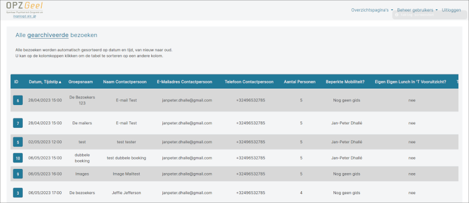

# Documentatie boekingssysteem

## Concept

Het doel van deze webapplicatie is om het hele boekingsproces voor een bezoek aan het museum voor een groep met gids te vergemakkelijken, met behulp van een automatisch e-mailsysteem en een website met login voor gidsen.

Dit systeem geeft alle gidsen toegang tot een overzicht met gidsbeurten en houdt hen op de hoogte van veranderingen en nieuwe boekingen via automatische e-mails. Ook zijn overlappende bezoeken onmogelijk, omdat dit gecheckt wordt bij elke nieuwe aanvraag.

In het geval van een nieuwe aanvraag, krijgen alle gidsen een e-mail met alle gegevens van de aanvraag. Ze moeten dan voor zichzelf nagaan of ze beschikbaar zijn op het gevraagde tijdstip. Indien dit het geval is, kunnen ze zichzelf opgeven om dit bezoek te gidsen door op een link klikken in de e-mail.
Hierdoor is het bezoek ook bevestigd en krijgt de bezoeker een bevestigings-e-mail. Alle andere gidsen zullen hiervan op de hoogte gebracht worden via mail.

Indien er na 5 dagen nog steeds geen gids is aangesteld voor een nieuwe aanvraag, veronderstelt het systeem dat niemand beschikbaar is en wordt het bezoek automatisch gearchiveerd. De bezoeker wordt hiervan verwittigd en hij wordt uitgenodigd een nieuwe aanvraag in te dienen.

Bezoeken die voorbij zijn gaan ook automatisch naar het archief.

### Gebruiksvriendelijk

We willen de applicatie **toegankelijk** maken voor iedereen. Daarom is er op elke pagina en in elke e-mail een gedetailleerde uitleg aanwezig.

Het formulier dat de bezoeker moet invullen bevat ook helptekst en verwijzingen naar andere pagina's met meer uitleg.

### Flexibiliteit

De applicatie is ontworpen met **flexibiliteit** in het achterhoofd. In de realiteit kan er altijd iets veranderen of iets gebeuren waardoor gegevens moeten worden aangepast. Onze applicatie geeft de gidsen daarom de mogelijkheid om de gegevens van een bezoek aan te passen.
Dit betekent ook dat een gids altijd contact kan opnemen met de bezoeker zelf, of omgekeerd om iets af te spreken en dit achteraf in het systeem aan te passen.

## Bezoeker

Een bezoeker ziet enkel het formulier. Alle verplichte velden zijn met een rode asterisk gemarkeerd. Indien de bezoeker een ongeldig telefoonnummer, e-mailadres of aantal personen invult, zal hij verwittigd worden en moet dit veranderd worden.

Bij het indien wordt er ook een controle gedaan op het gekozen tijdstip. Wanneer dit tijdstip twee uur of minder voor een reeds gepland bezoek is, wordt dit niet geaccepteerd en moet er een nieuw moment gekozen worden. Hetzelfde is het geval wanneer het gekozen tijdstip twee uur of minder na een reeds gepland bezoek is.

### Formulier

## Gids

Alle gidsen krijgen een gebruikersnaam en een wachtwoord, zodat ze op de webapplicatie kunnen inloggen.
Deze gegevens kunnen aangemaakt worden door een administrator.
Nadat ze ingelogd zijn op de applicatie krijgen de gidsen toegang tot de volgende pagina's:

### Uw bezoeken

### Alle bezoeken

### Detailpagina bezoek

Je kan een bezoek in detail bekijken door op de nummer te klikken in de overzichtstabel. Via deze pagina kan de gids de gegevens van een bezoek aanpassen, de toegewezen gids veranderen en het bezoek archiveren (wanneer niemand beschikbaar is om te gidsen, dit wordt gezien als een annulering en de gebruiker wordt hierna verwittigd).

### Archief

## Administrator

De website kan ook een of meerdere administrators hebben. Deze gebruikers hebben meer rechten, wat hen toegang geeft tot het admin-paneel en een pagina om gidsen aan te maken.

Het is daarom de verantwoordelijkheid van de administrator om nieuwe gidsen aan te maken en op inactief te plaatsen in het systeem.

### Nieuwe gids pagina

### Admin-paneel

#### Gegevens gebruiker/gids aanpassen

In het admin-paneel ziet de administrator een lijst met alle gebruikers. De administrator kan op de naam van een gebruiker klikken en de gegevens hiervan aanpassen.

#### Gebruiker/gids verwijderen

Het is afgeraden om een gebruiker/gids volledig uit het systeem te verwijderen, aangezien deze mogelijk gelinkt is aan bezoeken (archief of niet).
Beter is om de gids als inactief in te stellen via het admin-paneel. Een inactieve gebruiker kan niet meer inloggen op de webapplicatie en heeft dus geen toegang meer tot de overzichtspagina's of bezoeken.

#### Modules

Het museum biedt verschillende programma's aan in de vorm van modules. Deze modules kunnen verwijderd, aangepast en toegevoegd worden via het admin-paneel.
